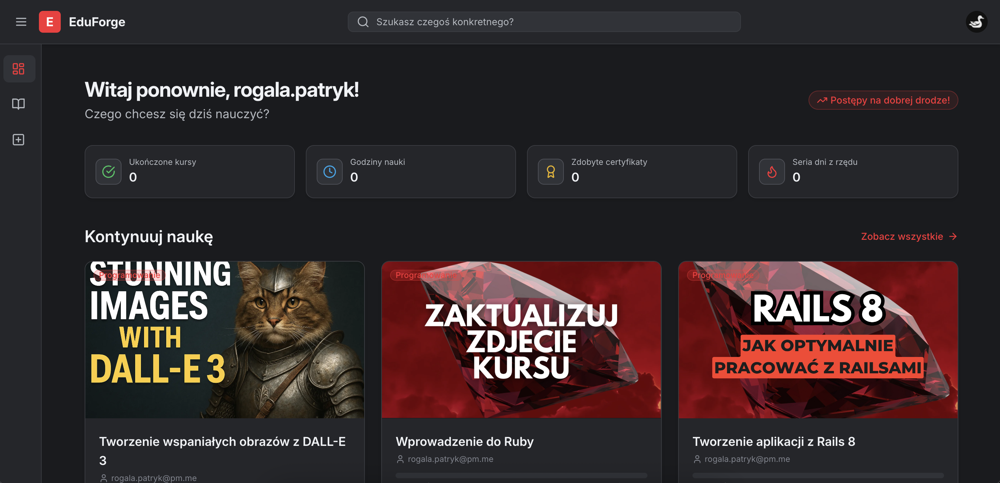

<div align="center">


# ✨ EduForge - Modern E-Learning Platform ✨



**Empowering interactive and engaging online education with Ruby on Rails.**

[](https://github.com/rubocop/rubocop)
[](https://opensource.org/licenses/MIT)
[](https://github.com/PatRogala/eduforge/actions/workflows/ci.yml)

</div>

EduForge is a comprehensive e-learning platform built using the power and elegance of Ruby on Rails. It aims to provide a seamless and feature-rich environment for both educators and learners, fostering an interactive and effective online learning experience.

<!--  -->

---

## 🚀 Core Features

*   👤 **User Authentication & Authorization:** Secure sign-up, sign-in, and role management powered by Devise.
*   📚 **Course Management System:** Intuitive interface for instructors to create, manage, and structure courses.
*   🧩 **Interactive Learning Materials:** Rich text content editing (ActionText/Trix) and support for programming tasks with code editors (Ace Editor).
*   📈 **Progress Tracking:** (Future Feature) Monitor learner progress through courses and lessons.
*   ✅ **Assessment System:** (Future Feature) Integrated quizzes and assignments to evaluate learning.
*   🎨 **Modern UI:** Clean and responsive user interface built with Tailwind CSS and enhanced with Hotwire (Turbo & Stimulus) for dynamic interactions.
*   🛠️ **Instructor Tools:** Dedicated section for instructors to manage their courses and content.
*   🔍 **Admin Capabilities:** (Future Feature) Site-wide administration tools.

---

## 🛠️ Tech Stack

*   **Backend:** Ruby on Rails 8.0
*   **Frontend:** Hotwire (Turbo & Stimulus), Tailwind CSS
*   **Database:** PostgreSQL
*   **Authentication:** Devise
*   **Rich Text:** ActionText (Trix Editor)
*   **Code Editor:** Ace Editor
*   **Background Jobs:** Sidekiq
*   **Caching:** Solid Cache
*   **Database Monitoring:** PgHero (Admin access only)
*   **JavaScript Bundling:** Bun
*   **Deployment:** Kamal
*   **Logging (Production):** Lograge (JSON format)

---

## 📋 Prerequisites

Ensure you have the following installed on your system:

*   Ruby `3.4.4` (or as specified in `.ruby-version`)
*   PostgreSQL (`17` or compatible)
*   Node.js (for JavaScript runtime dependencies)
*   Bun (for JavaScript package management and building)

---

## 💻 Development Setup

Get EduForge running locally in just a few steps:

1.  **Clone the repository:**
    ```bash
    git clone https://github.com/PatRogala/eduforge.git
    cd eduforge
    ```

2.  **Install dependencies:**
    *   Ruby Gems:
        ```bash
        bundle install
        ```
    *   JavaScript Packages:
        ```bash
        bun install
        ```

3.  **Set up the database:**
    *   Ensure PostgreSQL is running.
    *   Create and migrate the database:
        ```bash
        bin/rails db:create db:migrate db:seed
        ```
        *(The `db:seed` command creates default user roles).*

4.  **Build CSS & JavaScript:**
    ```bash
    bun run build # Build JS assets
    bun run build:css # Build CSS assets
    ```
    *(Note: `bin/dev` usually handles this automatically, but manual build is good to know).*

5.  **Start the development server:**
    ```bash
    bin/dev
    ```
    This will typically start the Rails server, CSS watcher, and JS builder using Foreman or a similar tool based on `Procfile.dev`.

6.  **Visit:** Open your browser to `http://localhost:3000`

---

## 🐳 Docker Development Setup

Prefer Docker? We've got you covered:

1.  **Build and start the containers:**
    ```bash
    docker compose up --build
    ```
    *(This might take a while on the first run).*

2.  **Set up the database (in *another* terminal window):**
    ```bash
    docker compose exec eduforge bin/rails db:setup
    ```
    *(`db:setup` runs `db:create`, `db:schema:load`, and `db:seed`).*

3.  **Visit:** Open your browser to `http://localhost:3000`

**Useful Docker Commands:**

*   Stop the application: `docker compose down`
*   View logs: `docker compose logs -f eduforge` (or `docker compose logs -f` for all services)
*   Run Rails console: `docker compose exec eduforge bin/rails console`
*   Run database console: `docker compose exec eduforge bin/rails dbconsole`
*   Run tests: `docker compose exec eduforge bin/rails spec`

---

## ✅ Testing

Run the full RSpec test suite:

```bash
bin/rails spec
# Or within Docker:
# docker compose exec eduforge bin/rails spec
```

---

## 🚢 Deployment

This application is configured for streamlined deployment using [Kamal](https://kamal-deploy.org/):

1.  Configure your `config/deploy.yml` and `.env` files with your server details and secrets.
2.  Set up your server(s) using `kamal setup`.
3.  Deploy the application:
    ```bash
    bin/kamal deploy
    ```

---

## ⚙️ Key Configuration Details

### Production Logging with Lograge

EduForge utilizes [Lograge](https://github.com/roidrage/lograge) in production for cleaner, structured JSON logs, ideal for log aggregation systems (ELK, Datadog, Splunk, etc.).

*   **Enabled:** In `config/environments/production.rb`.
*   **Format:** JSON (`Lograge::Formatters::Json`).
*   **Custom Fields:** Includes `exception`, `exception_message`, `time`, `host`, `pid`.
*   **Output:** `log/lograge_production.log`.
*   **Original Rails Log:** Standard Rails log (`log/production.log`) is kept for detailed debugging (`config.lograge.keep_original_rails_log = true`).

### Default Database Timestamp Type (`timestamptz`)

To ensure consistent timezone handling across the application, all `:datetime` columns defined in migrations automatically use PostgreSQL's `timestamptz` (timestamp with time zone) data type. This is configured via an initializer (`config/initializers/postgres.rb`).

---

## 🙌 Contributing

Contributions are welcome! Whether it's bug reports, feature suggestions, or code contributions, please feel free to help make EduForge better.

1.  Fork the repository.
2.  Create your feature branch (`git checkout -b feature/my-new-feature`).
3.  Commit your changes (`git commit -am 'Add some feature'`).
4.  Push to the branch (`git push origin feature/my-new-feature`).
5.  Create a new Pull Request.

Please adhere to the project's code style (Rubocop) and ensure tests pass. For major changes, please open an issue first to discuss what you would like to change.

<!-- *(Consider adding a `CONTRIBUTING.md` file with more detailed guidelines).* -->

---

## 📜 License

EduForge is open-sourced software licensed under the [MIT license](https://opensource.org/licenses/MIT).

---
